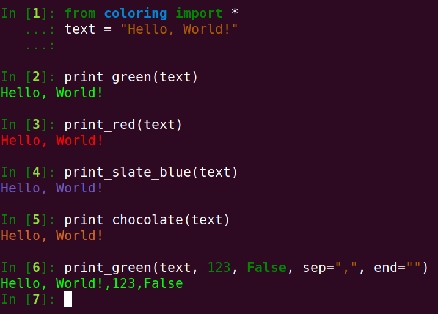

[](https://pypi.org/project/coloring/) [](https://pypi.org/project/coloring/) [](https://github.com/psf/black) [](https://codecov.io/gh/nazime/coloring) [](https://travis-ci.com/Nazime/coloring)

-----------------

# Coloring

Coloring is an other python library used to colorize texts in terminal using ANSI escape with a pythonic API.

## Why an other coloring library?

Many **excellent** coloring library for python already exist like [colorama](https://github.com/tartley/colorama). I wanted to create an other library with a more **pythonic API** that I could **directly use** without wrapping the existing functions.

I also wanted to add some features like

- Support 24 bits colors (RGB colors) for foreground and background
- Support different styles (bold, dim, italic, cross, underline, double_underline, blink)
- Functions to remove colors, backgrounds and styles from strings (remove ANSI escape)
- Many conveniences functions, so I can directly use the library
- The colorized prints functions respect the same signature as the built-in print function
- Usable through CLI (mainly to remove ANSI escapes)

## Install

Install directly with pip

```bash
pip3 install coloring
```

Install locally

```bash
git clone https://github.com/nazime/coloring
cd coloring
pip3 install .
```

## Demo

[](https://asciinema.org/a/350235)

## Usage

### Convenience functions

Coloring have many convenience functions meant to be used directly and easily. The library have +400 RGB colors parsed from [X11 colors](https://www.w3schools.com/colors/colors_x11.asp), +100 of those colors have convenience functions.

#### print_\<colorname\>

**print_\<colorname\>(*args,  sep: str = ",", end: str = "\n", flush: bool = False, file=sys.stdout)**: functions with the same signature as the built-in print function, with a specific color.

```python
from coloring import *

text = "Hello, World!"

print_green(text)
print_red(text)
print_slate_blue(text)
print_chocolate(text)
print_green(text, 123, False, sep=",", end="")
```




#### print_b\<colorname\>

**print_b\<colorname\>(*args,  sep: str = ",", end: str = "\n", flush: bool = False, file=sys.stdout)**: functions with the same signature as the built-in print function, with a specific color **in bold style**.

```python
from coloring import *

text = "Hello, World!"

print_bgreen(text)
print_bred(text)
print_bslate_blue(text)
print_bchocolate(text)
print_bgreen(text, 123, False, sep=",", end="")
```


#### print_\<style\>

**print_\<style\>(*args,  sep: str = ",", end: str = "\n", flush: bool = False, file=sys.stdout)**: functions with the same signature as the built-in print function, with a specific style.


```python
from coloring import *

text = "Hello, World!"

print_bold(text)
print_dim(text)
print_underline(text)
print_double_underline(text)
print_italic(text)
print_cross(text)
print_blink(text)
print_bold(text, 123, False, sep=",", end="")
```


#### \<colorname\>

**\<colorname\>(string: str) -> str**: function that return a colorized string with the color \<colorname\>.

```python
from coloring import *

print("Hello,", green("World"), "!")
print("Hello,", red("World"), "!")
print("Hello,", slate_blue("World"), "!")
print("Hello,", chocolate("World"), "!")
```


#### b \<colorname\>

**b\<colorname\>(string: str) -> str**: function that return a colorized string with the color \<colorname\> in bold style.

```python
from coloring import *

print("Hello,", bgreen("World"), "!")
print("Hello,", bred("World"), "!")
print("Hello,", bslate_blue("World"), "!")
print("Hello,", bchocolate("World"), "!")
```


#### \<style\>

**\<style\>(string: str) -> str**: function that return a formatted string with the style \<style\>.

```python
from coloring import *

print(
    "Simple ",
    bold("bold "),
    dim("dim"),
    underline("underline "),
    double_underline("double_underline "),
    italic("italic "),
    cross("cross "),
    blink(" blink"),
)
```


#### Scripting functions

There is also three convenience functions that may be useful when scripting.

```python
from coloring import *

print_success("Flag found!")
print_failure("Flag not found!")
print_info("Script processing!")
```


### General functions

#### cprint

**cprint(*args,  c: Color = None, bg: Color, s: str = "", sep: str = ",", end: str = "\n", flush: bool = False, file=sys.stdout)**: cprint is the general function to print colorized text with a background and styles, the function support the same signature as the built-in print function. Color can be a string or a tuple containing RGB colors. See [Styles syntax](#Styles syntax) for styles.

```python
from coloring import cprint

text = "Hello, World!"

cprint(text)
cprint(text, c="red")
cprint(text, c=(255, 0, 0))
cprint(text, s="b")  # bold
cprint(text, bg="yellow")  # background
cprint(text, c="red", bg="yellow", s="bcu")
```


#### rgbprint

**rgbprint(red: int, green: int, blue: int, *args,  bg: Color, s: str = "", sep: str = ",", end: str = "\n", flush: bool = False, file=sys.stdout)**: Same as cprint function with a different syntax, take three RGB values of the color as parameter.


```python
from coloring import rgbprint

text = "Hello, World!"

rgbprint(255, 0, 0, text)
rgbprint(255, 0, 0, text, bg="yellow")
rgbprint(255, 0, 0, text, 123, True, bg="yellow", s="bcu")
```


#### colorize

**colorize(text: str,  c: Color = None, bg: Color, s: str = "")**: colorize is the general function to return a colorized string with a background and styles. Color can be a string or a tuple containing RGB colors. See [Styles syntax](#Styles syntax) for styles.

```python
from coloring import colorize

text = "Hello, World!"

print("Hello,", colorize("World"), "!")
print("Hello,", colorize("World", c="red"), "!")
print("Hello,", colorize("World", c=(255, 0, 0)), "!")
print("Hello,", colorize("World", s="b"), "!")
print("Hello,", colorize("World", bg="yellow"), "!")
print("Hello,", colorize("World", c="red", bg="yellow", s="bcu"), "!")
```


### Remove graphics

It is possible to remove graphics (color, background and styles) from a string by removing the ANSI escapes.

All of the following functions take a string as parameter and return a string.

- **rmgraphics:** Remove all graphics (color, background and style).
- **rmcolor:** Remove all foreground colors.
- **rmbackground:** Remove all background colors.
- **rmstyle:** Remove all styles (bold, dim, underline, double_underline, italic, cross, blink).
- **rmbold_and_dim:** Remove bold and dim styles. (Due to how ANSI escape work, it is not possible to remove only bold style).
- **rmunderline:** Remove underline and double underline styles.
- **rmitalic:** Remove italic style.
- **rmcross:** Remove cross tyle.
- **rmblink:** Remove blink style.


```python
from coloring import *

text = (
    "Simple "
    + green("color ")
    + colorize("background ", bg="yellow")
    + bold("bold ")
    + dim("dim ")
    + underline("underline ")
    + double_underline("double_underline ")
    + italic("italic ")
    + cross("cross ")
    + blink(" blink")
)

print(text)
print(rmgraphics(text))
print(rmcolor(text))
print(rmbackground(text))
print(rmstyle(text))
print(rmbold_and_dim(text))
print(rmunderline(text))
print(rmitalic(text))
print(rmcross(text))
print(rmblink(text))
```


### Available colors

It is possible to list all available colors with the list variable **COLOR_NAMES** or see their corresponding RGB values with dict variable **COLORS**.

```python
from pprint import pprint
from coloring import COLOR_NAMES, COLORS, demo_colors

print("Number of colors (with redundancy):", len(COLORS))
print("10 first color names", COLOR_NAMES[:10])

# print first 10 colors with their RGB values
pprint({k: COLORS[k] for k in COLOR_NAMES[:10]})
```


The function ``demo_colors()`` will print all available colors to see how it looks in your terminal.

```python
from coloring import demo_colors

demo_colors()
```


### Create convenience functions

It is possible to create convenience functions like green and print_green for a specific color, background and styling. It is interesting when you use the same format several times, it is also slightly optimized since it don't have to parse the parameters each time.

#### create_print

**create_print(color_or_red: Union[int, Color] = None, green: int = None, blue: int = None, *,  bg: Color, s: str = "",  name: str = None)**: return a convenience function like color_green.

For the foreground color, it can be called with a string, a tuple or three int representing the RGB colors.
The parameter name can be used to change the name of the function (\_\_name\_\_ )

```python
from coloring import create_print

myprint = create_print("red", bg="yellow", s="bU")
myprint("Hello, World!")

myprint = create_print(0, 255, 0, s="c")
myprint("Hello, World!")
```


 #### create_color

**create_color(color_or_red: Union[int, Color] = None, green: int = None, blue: int = None, *,  bg: Color, s: str = "",  name: str = None)**: create color has the same signature as ``create_print`` and return a function to colorize like the function ``green``.


```python
from coloring import create_color

mycolor = create_color("red", bg="yellow", s="bU")
print("Hello,", mycolor("World"), "!")

mycolor = create_color(0, 255, 0, s="c")
print("Hello,", mycolor("World"), "!")
```


### Styles syntax

Most of the functions accept styles as a single string where each character represent a single style, the characters can be in any order. Most of the styles are represented by their first letter, except when the letter is already taken.

- b: bold
- d: dim
- c: cross
- k: blink
- u: underline
- U: double underline
- i: italic

Example ``buc`` mean bold, underlined and crossed.

### CLI

```bash
echo Hello | coloring red
coloring --help
coloring red Hello | coloring rmgraphics
```


# Support Windows

The coloring library support new version of windows by activating [Console Virtual Terminal Sequences](https://docs.microsoft.com/en-us/windows/console/console-virtual-terminal-sequences#text-modification).

# Contribute

Contributions are highly welcomed and appreciated, you can contribute by doing one of the following:

- Resolve issues in the [TODO](#TODO) list
- Resolve TODO and FIXME in the source code
- Writing tests (the project use pytest)
- Reports/fix bugs
- Implement/propose new features (propose a feature before implementing it), test the feature when you implement it.
- Give feedback
- Improve/Write the documentation

## TODO

- [ ] [EASY] Support hex colors (in function normalize_color)
- [ ] [EASY] Fix/improve/test/document gradient function
- [ ] [MEDIUM] Support gradient function with more than two colors
